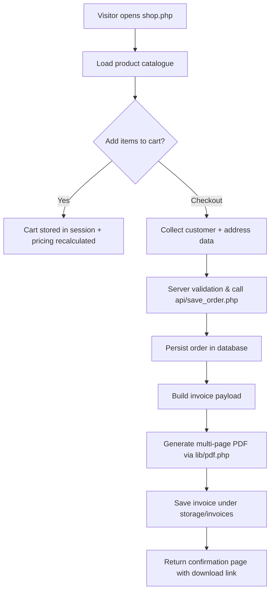

# Crackers Store Portal

This project powers the Crackers online ordering portal used to manage product listings, customer orders, and invoice generation. The application is written in PHP with a lightweight custom PDF generator for invoices.

## Getting Started
- PHP 8.x with GD extension enabled (for JPEG parsing in the invoice generator)
- MySQL-compatible database with the schema from the `db/` directory
- Composer is not required; dependencies are bundled in `lib/` and `inc/`
> Need a deeper dive? See `CODE_OVERVIEW.md` for architecture notes and module-level details.

### Local Setup
1. Clone the repository in a writable web root (e.g. `htdocs/Crackers`).
2. Copy `config.local.php` to `config.php` and update database credentials.
3. Point your local web server to the project root and ensure `storage/` is writable.
4. Import the base SQL schema and seed data from `db/` if you need sample content.

## Recent Updates
- PDF invoices now span multiple pages automatically, keeping totals and amount-in-words on the final page only.
- Continuation notices and page numbers help customers follow long invoices.

## Security Notes
- Always validate user input when adding new API endpoints (use prepared statements in `api/`).
- Keep `config.local.php` and other credential files outside version control or protected with strict permissions.
- Regenerate and rotate database credentials regularly; never hard-code secrets in client-facing scripts.
- Ensure `/storage` is not directly exposed over the web—use `.htaccess` or server rules to block raw listing.

## Git Workflow
1. Create a feature branch before committing changes: `git checkout -b feature/<name>`.
2. Stage files with `git add`, then commit using concise messages (`git commit -m "Describe change"`).
3. Rebase or merge from `main` (or `stage`) to keep your branch up to date before pushing.
4. Push with `git push origin feature/<name>` and open a pull request targeting the desired branch.
5. After review, squash or merge following project conventions; delete merged branches to keep history clean.

## End-to-End Order Flow
1. Visitor lands on `shop.php` and browses products pulled from the inventory tables.
2. Items added to cart are persisted in session storage; pricing and discounts are recalculated per item.
3. Checkout collects customer details, validates them server-side, and triggers `api/save_order.php`.
4. The order is written to the database, confirmation email/notifications are queued, and the invoice payload is prepared.
5. `lib/pdf.php` renders the complete invoice (multi-page when required) and stores it under `storage/invoices`.
6. The user is redirected to the order confirmation page and can download the generated PDF from there.

## Inventory Management Flow
1. Admin signs into `inventory/login.php` with role-based credentials.
2. `inventory/dashboard.php` surfaces order metrics and links to inventory tools.
3. Product lifecycle:
   - Create/update items via `inventory/product.php` (SKU, price, stock, images).
   - Uploads land in `images/products`; database updates run inside a transaction.
   - Deleting a product clears related item rows and removes stored media.
4. Order administration:
   - `inventory/order_edit.php` handles manual order creation and modifications.
   - Saving recalculates totals and updates the order + item tables.
   - `inventory/order_delete.php` removes orders and item rows after CSRF checks.
5. Admins download invoices directly from the dashboard using `api/order_pdf.php`.
6. Schedule periodic database backups to preserve inventory and order history.

## Next Steps
- Expand README with environment-specific configuration once deployment targets are finalised.
- Add automated tests or linting scripts to validate invoice generation and key business flows.
